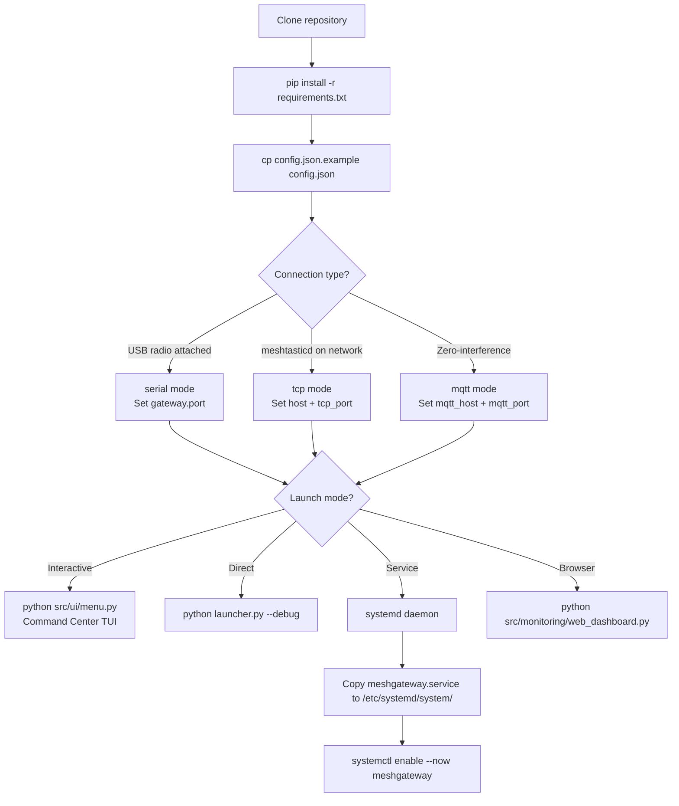
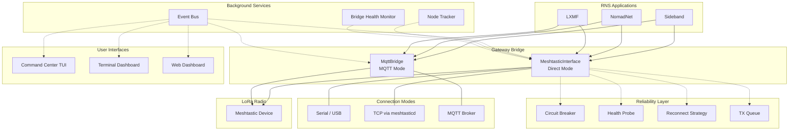
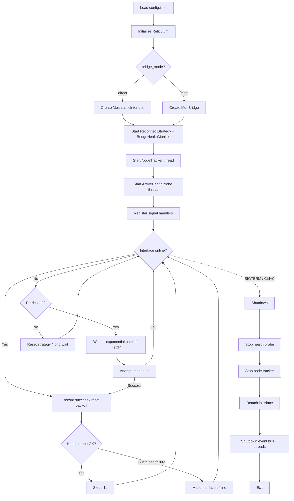
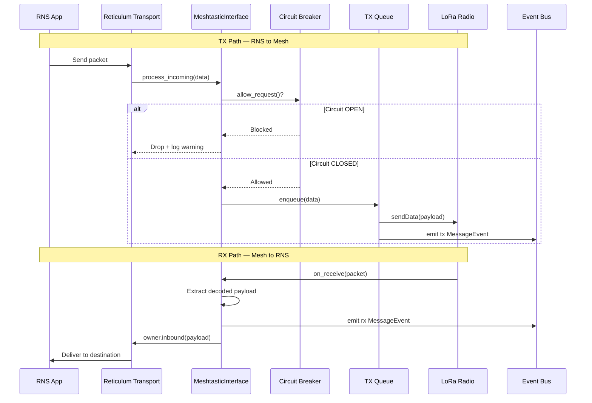
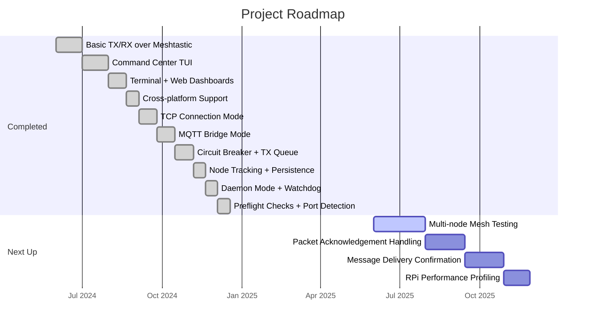

# Supervisor NOC: RNS-Meshtastic Gateway

**Status:** Alpha — functional but under active testing
**Version:** 1.5
**License:** GPL-3.0
**Python:** 3.9+

> Bridges the **Reticulum Network Stack (RNS)** with **Meshtastic LoRa radios**, allowing RNS traffic (LXMF messages, Sideband, NomadNet, etc.) to ride over LoRa hardware.

## Quick Start

```bash
# 1. Clone
git clone https://github.com/Nursedude/RNS-Meshtastic-Gateway-Tool.git
cd RNS-Meshtastic-Gateway-Tool

# 2. Install dependencies
pip install -r requirements.txt

# 3. Configure
cp config.json.example config.json
# Edit config.json — set your serial port or switch to TCP/MQTT mode

# 4. Launch
python src/ui/menu.py
```

## Installation

### Prerequisites

- Python 3.9 or newer
- A Meshtastic radio (connected via USB or accessible via meshtasticd TCP)
- pip (Python package manager)

### Install

```bash
git clone https://github.com/Nursedude/RNS-Meshtastic-Gateway-Tool.git
cd RNS-Meshtastic-Gateway-Tool
pip install -r requirements.txt
```

### Update

```bash
cd RNS-Meshtastic-Gateway-Tool
git pull --ff-only
pip install --upgrade -r requirements.txt
```

Or use option **9** in the Command Center menu to pull updates directly.

### Configuration

Copy the example config and edit it for your setup:

```bash
cp config.json.example config.json
```

**Key settings in `config.json`:**

| Setting | Description | Default |
|---------|-------------|---------|
| `gateway.connection_type` | `serial` or `tcp` | `serial` |
| `gateway.port` | Serial device path (`/dev/ttyUSB0`, `COM3`, etc.) | `COM3` |
| `gateway.host` / `gateway.tcp_port` | meshtasticd TCP address (when using `tcp` mode) | `localhost:4403` |
| `gateway.bridge_mode` | `direct` (Meshtastic API) or `mqtt` (zero-interference MQTT bridge) | `direct` |
| `gateway.bitrate` | LoRa bitrate in bps | `500` |
| `dashboard.host` / `dashboard.port` | Web dashboard bind address | `127.0.0.1:5000` |
| `features.circuit_breaker` | Enable TX circuit breaker | `true` |
| `features.tx_queue` | Enable async TX queue | `true` |
| `features.message_queue` | Enable persistent message queue with retries | `false` |

If no serial port is set, the tool auto-detects connected devices.

### Setup at a Glance



## Usage

### Command Center (recommended)

```bash
python src/ui/menu.py
```

Interactive TUI menu with service status indicators, config editors, and diagnostic tools.

### Direct Gateway Launch

```bash
python launcher.py [--debug]
```

### Daemon Mode (systemd)

```bash
python src/daemon.py start    # Start in foreground (for systemd)
python src/daemon.py stop     # Stop running gateway
python src/daemon.py status   # Check if running
python src/daemon.py restart  # Stop + start
```

### Web Dashboard

```bash
python src/monitoring/web_dashboard.py
```

Opens a browser dashboard at `http://127.0.0.1:5000` with system status, known nodes, and recent messages. Auto-refreshes every 30 seconds.

## Architecture



**Core modules:**

- **`launcher.py`** — Main entry point. Initializes RNS, loads config, starts the driver with auto-reconnect and health monitoring.
- **`src/Meshtastic_Interface.py`** — Custom RNS interface translating packets into Meshtastic `sendData()` calls. Supports serial, TCP, and auto-detection.
- **`src/mqtt_bridge.py`** — Alternative MQTT bridge mode that doesn't interfere with meshtasticd's web client.
- **`src/daemon.py`** — Service management with PID locking and watchdog auto-restart.

**UI:**

- **`src/ui/menu.py`** — Command Center TUI with cached service status and startup preflight checks.
- **`src/ui/dashboard.py`** — Terminal snapshot of system info, libraries, services, and config.
- **`src/monitoring/web_dashboard.py`** — Flask browser dashboard.

**Reliability (in `src/utils/`):**

- Circuit breaker, TX queue, reconnect with exponential backoff + jitter
- Active health probe with hysteresis
- Event bus for decoupled RX/TX notifications
- Node tracker with JSON persistence

### Gateway Lifecycle



### Packet Flow



## Connection Modes

| Mode | Config | Use Case |
|------|--------|----------|
| **Serial** | `connection_type: "serial"` | Radio plugged in via USB |
| **TCP** | `connection_type: "tcp"` | Radio managed by meshtasticd on the network |
| **MQTT** | `bridge_mode: "mqtt"` | Zero-interference bridge via MQTT broker |

## Using with MeshForge

This gateway works as a standalone tool or as part of a [MeshForge](https://github.com/Nursedude/meshforge) deployment. MeshForge provides a full mesh network operations center — live NOC maps, multi-network bridging, RF tools, and more.

When running under MeshForge:

- MeshForge manages service lifecycles (rnsd, meshtasticd) — the gateway integrates with its health check and startup patterns
- Shared architectural patterns: circuit breaker, reconnect strategy, event bus, and status caching are aligned between both projects
- The gateway can be launched from MeshForge's TUI or run independently

To use standalone, no MeshForge installation is needed — the gateway has no dependency on it.

## Testing Status

This project is in **alpha**. Core gateway functionality (TX/RX, reconnect, health monitoring) is functional but many features need real-world multi-node testing.

**What has been tested:**

- Single-node TX/RX over serial and TCP
- Circuit breaker and reconnect logic (unit tests)
- TUI menu and dashboard rendering
- MQTT bridge message flow (unit tests)
- 436 unit tests passing

**What needs more testing:**

- Multi-node mesh scenarios
- Long-running stability (24h+ uptime)
- MQTT bridge under real broker load
- Packet acknowledgement and delivery confirmation
- Edge cases: radio disconnect during TX, firmware updates, channel changes
- Web dashboard under concurrent access
- Daemon watchdog recovery scenarios

### Running Tests

```bash
pip install -r requirements-dev.txt
pytest tests/ -v
```

## Troubleshooting

| Problem | Fix |
|---------|-----|
| No LED activity on radio | Check that `ingress_control` is `False` in the driver |
| Crash on start | Verify RNS is installed (`pip install rns`) and check logs at `~/.config/rns-gateway/logs/` |
| "Port in use" error | The preflight check will warn you — stop the conflicting process or use a different port |
| No serial device found | Check USB connection; on Linux you may need `sudo usermod -aG dialout $USER` |
| Wrong serial port | Edit `config.json` and set `gateway.port` to your device path |
| Gateway starts but no traffic | Run the test ping from the Command Center (option 8) or check `rnstatus` (option 7) |
| Web dashboard won't start | Install Flask: `pip install flask` |

Logs are written to `~/.config/rns-gateway/logs/`. Use `--debug` for verbose output.

## Security

See [`docs/SECURITY.md`](docs/SECURITY.md) for the full security review.

Key points:

- Web dashboard binds to `127.0.0.1` by default — do not expose to untrusted networks without authentication
- `config.json` is gitignored to prevent credential leaks — never commit it
- Environment variable editor detection is validated against PATH to prevent injection
- Dependencies are pinned to compatible ranges — keep them updated

## Roadmap


