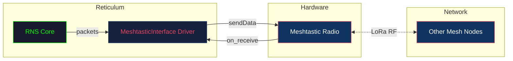
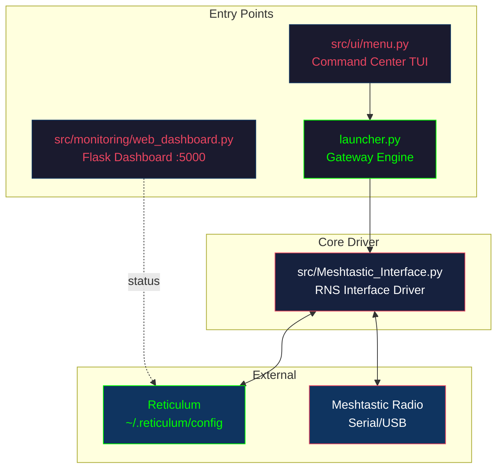
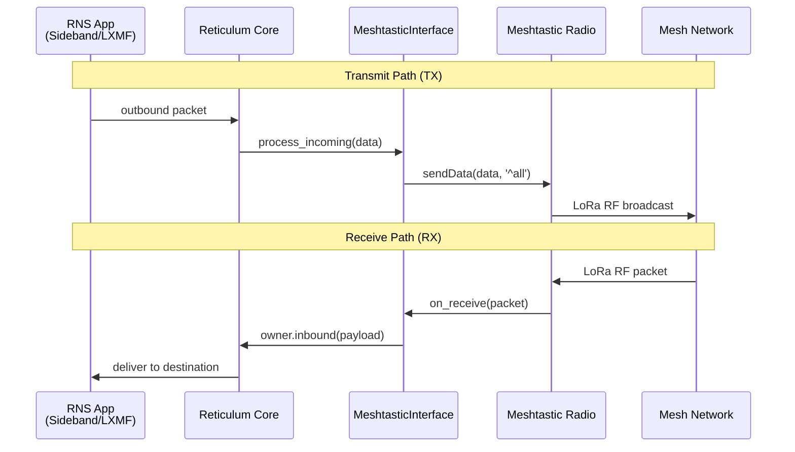
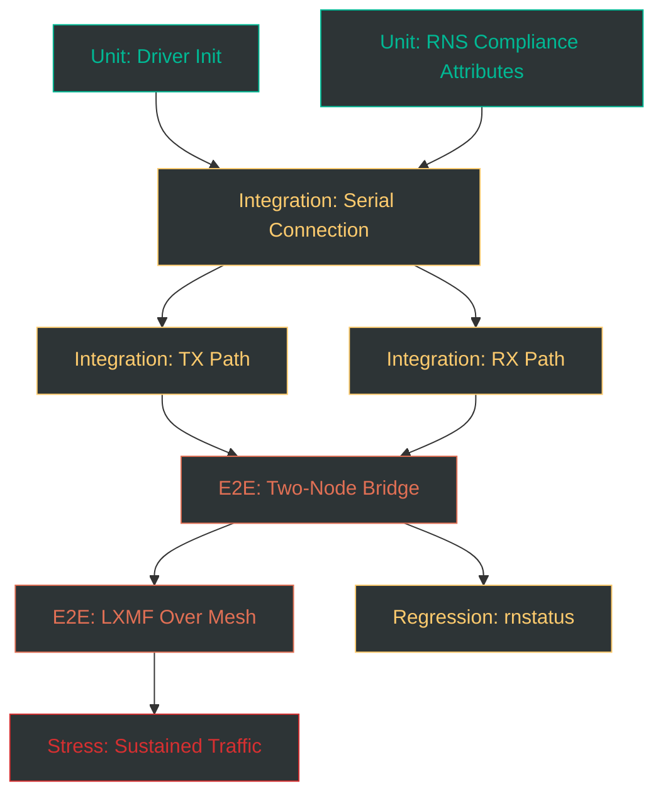
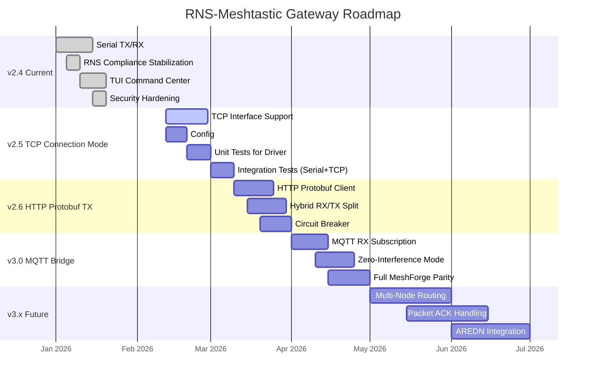
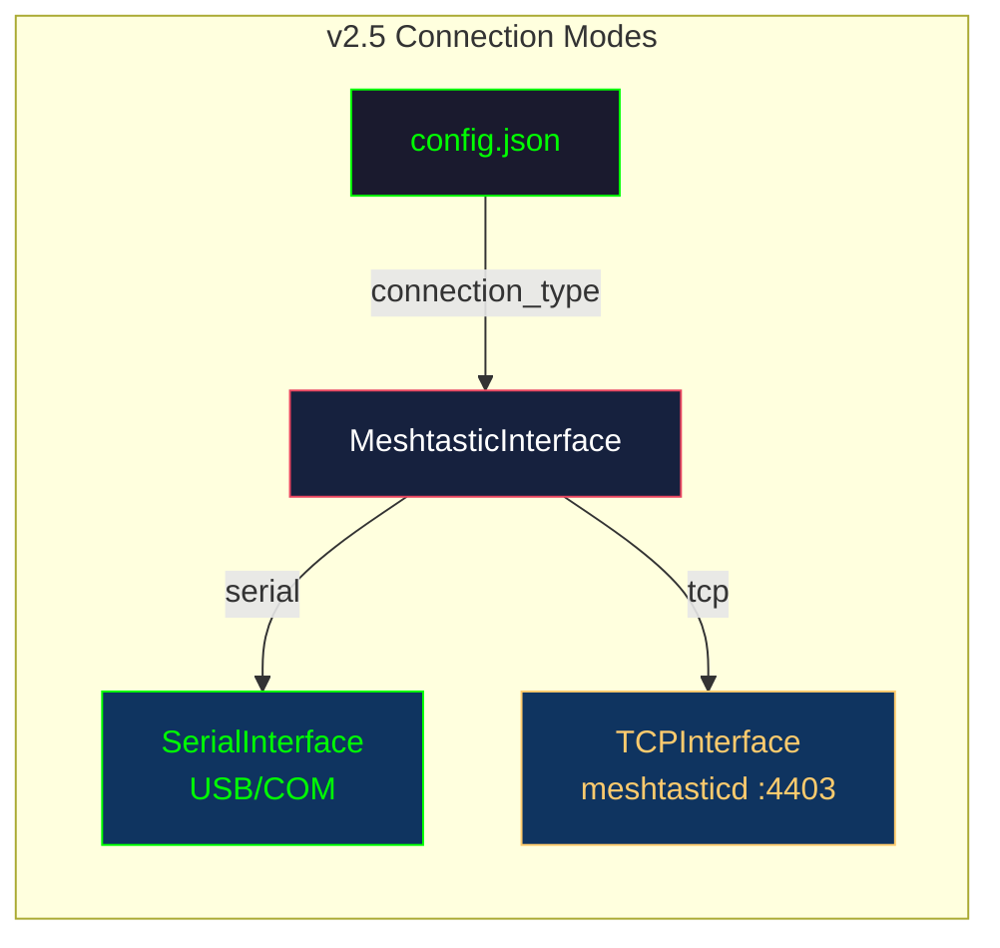
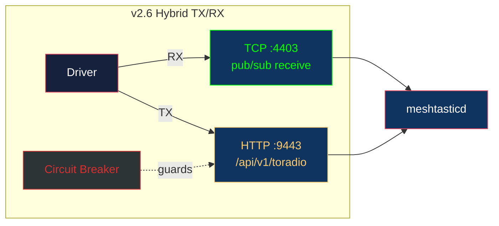
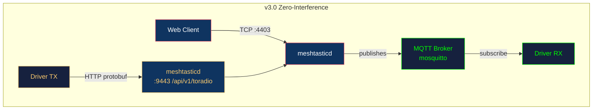

# RNS-Meshtastic Gateway Tool

> Bridge the **Reticulum Network Stack (RNS)** with **Meshtastic LoRa radios** — route LXMF messages, Sideband traffic, and NomadNet pages over LoRa hardware.

**Version:** 2.4.0-alpha
**License:** GPL-3.0
**Python:** 3.9+
**Part of the [MeshForge](https://github.com/Nursedude/MeshForge) ecosystem**

---

## How It Works

The gateway sits between Reticulum and your Meshtastic radio. RNS packets go in, LoRa packets come out (and vice versa).



## Architecture



### Project Structure

```
RNS-Meshtastic-Gateway-Tool/
├── launcher.py                  # Gateway entry point — init RNS, load driver, keep alive
├── config.json.example          # Configuration template
├── requirements.txt             # Dependencies: rns, meshtastic, pyserial
├── start_gateway.bat            # Windows quick-start
│
├── src/
│   ├── Meshtastic_Interface.py  # RNS ↔ Meshtastic driver (core)
│   ├── proven_supervisor.py     # Supervisor logic
│   ├── monitoring/
│   │   └── web_dashboard.py     # Flask status dashboard
│   └── ui/
│       ├── menu.py              # TUI Command Center v4.1
│       ├── dashboard.py         # Terminal dashboard display
│       └── widgets.py           # Shared box-drawing widgets
│
├── tests/
│   └── broadcast.py             # RNS announce test utility
│
└── docs/
    └── KNOWLEDGE_BASE.md        # Crash resolutions & RNS compliance notes
```

---

## Quick Start

### Prerequisites

- Python 3.9+
- Meshtastic radio connected via USB (or meshtasticd running for TCP mode — see [Roadmap](#roadmap))
- Reticulum installed and configured

### Install

```bash
git clone https://github.com/Nursedude/RNS-Meshtastic-Gateway-Tool.git
cd RNS-Meshtastic-Gateway-Tool
pip install -r requirements.txt
```

### Configure

```bash
cp config.json.example config.json
```

Edit `config.json` to match your setup:

```json
{
    "gateway": {
        "name": "Supervisor NOC",
        "port": "COM3",
        "bitrate": 500
    },
    "dashboard": {
        "host": "0.0.0.0",
        "port": 5000
    }
}
```

| Field | Description | Default |
|-------|-------------|---------|
| `gateway.port` | Serial port for Meshtastic radio | `COM3` |
| `gateway.bitrate` | LoRa bitrate proxy for RNS | `500` |
| `dashboard.host` | Web dashboard bind address | `0.0.0.0` |
| `dashboard.port` | Web dashboard port | `5000` |

**Linux serial ports:** `/dev/ttyUSB0`, `/dev/ttyACM0`, etc.

### Run

**Gateway only:**
```bash
python launcher.py
```

**Command Center (full TUI):**
```bash
python -m src.ui.menu
```

**Windows:**
```
start_gateway.bat
```

### Verify

Look for this output:
```
============================================================
  SUPERVISOR NOC | RNS-MESHTASTIC GATEWAY v2.4
============================================================

[GO] Loading Interface 'Meshtastic Radio'...
[Meshtastic Radio] Initializing on COM3...
[Meshtastic Radio] Hardware Connected Successfully.
 [SUCCESS] Interface Loaded! Waiting for traffic...
```

Then run `rnstatus` in another terminal to confirm the interface is registered.

---

## Data Flow



---

## Command Center

The TUI provides a unified control panel:

| Key | Action | Description |
|-----|--------|-------------|
| `1` | Start Mesh Gateway | Launch `launcher.py` in background |
| `2` | Start NomadNet | Launch NomadNet client |
| `3` | Open Web Deep-Dive | Open dashboard in browser |
| `d` | Terminal Dashboard | Live terminal status view |
| `4` | Edit Gateway Config | Open `config.json` in editor |
| `5` | Edit Reticulum Config | Open `~/.reticulum/config` |
| `6` | Edit NomadNet Config | Open `~/.nomadnet/config` |
| `7` | RNS Status | Run `rnstatus` |
| `8` | Fire Test Ping | Send broadcast announce |
| `9` | Git Update | `git pull --ff-only` |
| `0` | Exit | Quit Command Center |

---

## RNS Driver Compliance

The driver must satisfy strict RNS interface requirements or the stack will crash. These are documented in [`docs/KNOWLEDGE_BASE.md`](docs/KNOWLEDGE_BASE.md).

| Attribute | Type | Why It Matters |
|-----------|------|----------------|
| `ingress_control` | `bool = False` | Prevents "Traffic Cop" crash |
| `held_announces` | `list = []` | Must be list, not int — `len()` crash |
| `ia_freq_deque` | `deque(maxlen=100)` | Required by `rnstatus` |
| `oa_freq_deque` | `deque(maxlen=100)` | Required by `rnstatus` |
| `mode` | `MODE_ACCESS_POINT` | Correct reporting in `rnstatus` |

---

## Testing

> **Status: Needs Testing** — The gateway works in isolated manual tests but has not been through systematic validation.

### Test Plan



### Test Matrix

| ID | Test | Type | Hardware | Status |
|----|------|------|----------|--------|
| T1 | Driver initializes without crash (no radio) | Unit | None | Not run |
| T2 | All RNS compliance attributes present and correct types | Unit | None | Not run |
| T3 | Serial connection to Meshtastic radio succeeds | Integration | 1 radio | Not run |
| T4 | TX: RNS packet reaches radio (`sendData` called) | Integration | 1 radio | Not run |
| T5 | RX: Mesh packet delivered to RNS (`owner.inbound` called) | Integration | 1 radio | Not run |
| T6 | Two-node bridge: packet sent from Node A arrives at Node B | E2E | 2 radios | Not run |
| T7 | LXMF message traverses mesh (Sideband-to-Sideband) | E2E | 2 radios | Not run |
| T8 | Sustained traffic (100 packets, measure loss rate) | Stress | 2 radios | Not run |
| T9 | `rnstatus` reports interface correctly while gateway runs | Regression | 1 radio | Not run |

### Running Tests

```bash
# Broadcast test (requires radio connected)
python tests/broadcast.py

# RNS status check (requires gateway running)
python -m RNS.Utilities.rnstatus
```

---

## Roadmap



### Phase Details

#### v2.5 — TCP Connection Mode (Next)
Add meshtasticd TCP support alongside the existing serial path. No breaking changes.

| Task | Description | Files |
|------|-------------|-------|
| Add `TCPInterface` support | Connect via `meshtastic.tcp_interface.TCPInterface(host, port)` | `src/Meshtastic_Interface.py` |
| Config: `connection_type` | `"serial"` (default) or `"tcp"` with `host`/`tcp_port` fields | `config.json.example` |
| Pass config to driver | Load expanded config in launcher | `launcher.py` |
| Unit tests | Verify driver init, attribute compliance, connection mode selection | `tests/` |



#### v2.6 — HTTP Protobuf TX
Solve the meshtasticd **single-client TCP limitation** (port 4403 allows only ONE connection). Use HTTP API for transmit while keeping TCP/serial for receive.

| Task | Description |
|------|-------------|
| HTTP protobuf client | PUT `/api/v1/toradio` on port 9443 |
| Hybrid RX/TX split | RX via TCP pub/sub, TX via HTTP |
| Circuit breaker | Prevent cascading failures on connection loss |
| Auto-reconnect | Exponential backoff on disconnect |



#### v3.0 — MQTT Bridge Mode
Full MeshForge parity. Zero interference with the meshtasticd web client.

| Task | Description |
|------|-------------|
| MQTT RX | Subscribe to `msh/{region}/2/json/{channel}/#` |
| HTTP TX | Transmit via `/api/v1/toradio` protobuf |
| Zero-interference | No TCP connection held — web client works freely |
| Deduplication | 60-second window to prevent message loops |



#### v3.x — Future
- **Multi-node routing** — Map RNS destination hashes to Meshtastic node IDs
- **Packet ACK handling** — Delivery confirmation across the bridge
- **AREDN integration** — Third mesh ecosystem bridge
- **Coverage mapping** — RF link quality visualization

---

## Version History

| Version | Date | Milestone |
|---------|------|-----------|
| **2.4.0-alpha** | 2026-02-12 | Current — Serial TX/RX, TUI Command Center, security hardening |
| 2.3.0 | 2026-01-20 | Security patch (shell=False, subprocess timeouts) |
| 2.2.0 | 2026-01-15 | TUI Command Center v4.1, box-drawing widgets |
| 2.1.0 | 2026-01-10 | RNS compliance stabilization (ia_freq_deque, ingress_control, held_announces) |
| 2.0.0 | 2026-01-05 | MeshForge directory restructure, driver architecture |
| 1.0.0 | 2025-12 | Initial serial bridge (TX + RX) |

### Commit History Reference

```
cf5e7a7 docs: add session notes for meshtasticd HTTP API research
3b7908d Merge pull request #7 — extract box-drawing widgets
04565d2 refactor(ui): extract box-drawing widgets, fix bare excepts
bb3548f Merge pull request #6 — improve meshforge TUI
0316b16 feat(tui): overhaul Command Center with box-drawing UI
4bc0d66 feat(nomadnet): integrate nomad_pages skeleton
11fddd2 feat(ui): implement Supervisor Command Center
42f6435 chore: add .gitignore, remove pycache
69c9468 refactor: apply Meshforge directory structure
6738100 feat(gateway): stabilize RNS-Meshtastic bridge
872a1a8 security: enforce shell=False and subprocess timeouts
1dc3c19 initial: restored MeshForge environment
```

---

## Troubleshooting

| Symptom | Cause | Fix |
|---------|-------|-----|
| `Hardware Error: [Errno 2]` | Wrong serial port | Set `gateway.port` in `config.json` to your device (`/dev/ttyUSB0`, `COM3`, etc.) |
| `'meshtastic' library not found` | Missing dependency | `pip install meshtastic` |
| Crash on `rnstatus` | Missing deque attributes | Verify driver has `ia_freq_deque` and `oa_freq_deque` |
| "Traffic Cop" crash | `ingress_control` not set | Must be `False` in driver init |
| `held_announces` crash | Initialized as `int` | Must be `list []` |
| Packets not leaving radio | Missing broadcast flag | `sendData()` must use `destinationId='^all'` |
| Serial port locked | Another process has it | Only one process per port — stop conflicting scripts |
| Gateway starts but no traffic | RNS not finding interface | Check `~/.reticulum/config` and run `rnstatus` |

---

## Related Projects

- **[MeshForge](https://github.com/Nursedude/MeshForge)** — Full NOC with MQTT bridge, coverage mapping, RF tools
- **[Reticulum](https://github.com/markqvist/Reticulum)** — Encrypted networking stack
- **[Meshtastic](https://meshtastic.org/)** — LoRa mesh firmware
- **[NomadNet](https://github.com/markqvist/NomadNet)** — Resilient mesh communicator
- **[Sideband](https://github.com/markqvist/Sideband)** — Mobile LXMF client

---

## Contributing

1. Fork the repo
2. Create a feature branch (`git checkout -b feature/my-change`)
3. Commit with clear messages (`git commit -m "feat: add TCP connection mode"`)
4. Push and open a PR against `main`

See [`SESSION_NOTES_2026-02-12.md`](SESSION_NOTES_2026-02-12.md) for the current development plan.

---

## License

GPL-3.0 — See [LICENSE](LICENSE) for details.
